# 拡張カルマンフィルタ : Extended Kalman Filter (EKF)

## Note
この README.md だと文中の数式が見にくいので，同階層の「 [README.pdf]() 」を参照された方が見やすいかもしれません．

# はじめに

線形カルマンフィルタでは状態方程式や観測方程式を立てて次状態を予測し，センサなどの観測値から隠れ状態を推定しました．

しかし，線形カルマンフィルタでは状態方程式や，観測方程式が線形であるという制約があります．つまり非線形な方程式の場合は線形カルマンフィルタを適用できないということになります．

例えば，角度を推定したいというような場合は，たいてい $sin$ や $cos$ といった三関数が登場し，非線形な式となってしまうことが多々あります．

拡張カルマンフィルタ (Extended Kalman Filter, 以下 EKF) では，このような非線形な式を線形近似することで，線形カルマンフィルタが適用できる状態にします．

なお，本ページではカルマンフィルタの説明は行いません．カルマンフィルタの説明については [こちら](https://github.com/hsmtknj/robotics/tree/master/Linear_Kalman_Filter) を参照ください．

# 線形とは

まず，線形とは何でしょうか．これが分からなければ，線形カルマンフィルタを適用して良いのか，拡張カルマンフィルタを適用しなくてはならないのか判断ができません．

早速ですが，線形であるとは次の状態のことを言います．

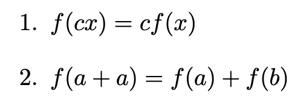

たったこれだけです．この2つを満たせばそれは線形であると言えます．
試しに $f(x)=5x$ と $f(x)=5x+1$ で上の2つを試してみるといいかもしれません．
そうすれば $f(x)=5x$ が線形で， $f(x)=5x+1$ が非線形であることが分かると思います．$f(x)=5x+1$ の方は $+1$ が邪魔して線形性の条件を満たせないのです．

イメージ的には，**原点を通る直線** といった感じでしょうか．かなり厳しい条件であることが分かりますが，線形であるという条件があれば解ける問題が多くあります．

逆に言うと無理やり線形の問題に置き換えることで，非線形であっても線形と同様に問題を解くことができるのです．

EKF もそんな手法のひとつというわけです．

# 一次近似による線形近似

さて，拡張カルマンフィルタでは，**非線形な式を線形な式に置き換えて** カルマンフィルタを適用します．

では，どのようにして **線形近似** するのでしょうか．

これは一次近似を行うことで，非線形な式を線形に近似できます．
例えば Fig.1 のように $y=(x-1)^2+1$ といった非線形式を $x=1$ まわりで 線形近似してみます．具体的には接線を求めてみましょう．

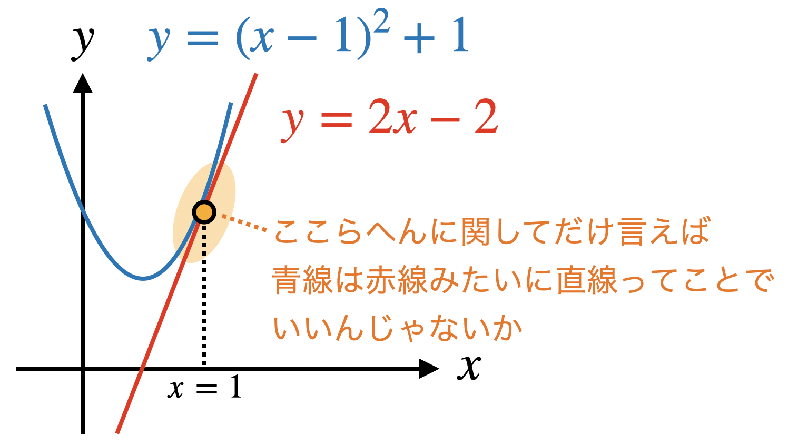
Fig.1 一次近似の例

Fig.1 のように **オレンジの範囲では青線は赤線みたいに直線でいいんじゃね** といった感じで無理やり置き換えてしまいます．

これを $x=x_0$ 周りで一次近似すると，一般的に次のような式となります．

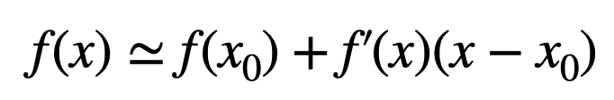

これを多次元に置き換えて考えた場合は次のような式となります．

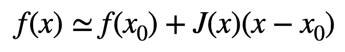

ここで $J(x)$ がヤコビアンと呼ばれる行列で，$f'(x)$ のように微分項に該当します．

また，$f'(x)=$ の形に直せばこれは単に傾きを求める式となりますね．誤差に注目した式に変換してみると次のようになります．

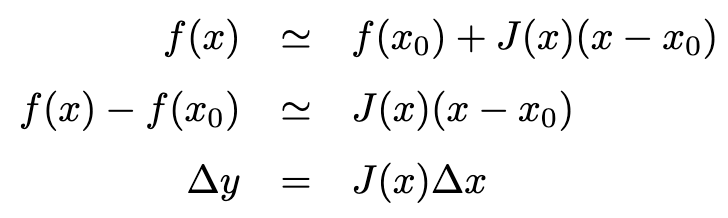

ちゃんと線形になっていますね．

# ヤコビアン

いきなりですが，$n$ 次元ベクトル $x=[x_1, x_2, ... , x_n ]$ を非線形な関数 $f(x_1, x_2, ... , x_n)$ によって $m$ 次元ベクトル $y=[y_1, y_2, ... , y_m ]$ に写像するような関係式 $y=f(x)$ がある場合，ヤコビアンは次のように定義されます．

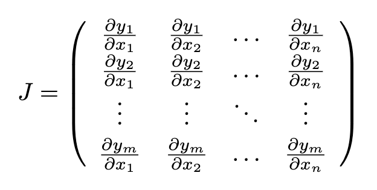

仮に，ベクトル $x$, $y$ が同じ長さであれば，ヤコビアン $J$ は正方行列となります．

非線形な関数であっても，ある点周りだけであれば，ヤコビアンを使うことで線形近似することができます．逆に言えば，その点から離れれば離れるほど近似が崩れやすいので，適用する際は注意が必要です．(分散が大きいようなケースでは EKF は有効ではないかもしれませんね．)

# ヤコビアンで線形近似

状態方程式や観測方程式を線形式に変換できれば，あとは線形カルマンフィルタとほとんど同様に状態を推定することができます．ここでは，非線形な状態方程式・観測方程式の予測誤差や入力誤差をヤコビアンを使って線形近似してみましょう．

仮に次のような状態方程式・観測方程式があると仮定します．

状態方程式 (非線形)

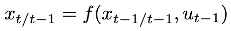

観測方程式 (非線形)

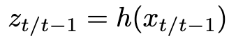

ここで，$f(x)$ と $h(x)$ は非線形な関数を表します．これらを一次近似によって次のように線形式に変形したいと思います．(あくまで $\Delta x$ や $\Delta u$ に対して線形なのであって，$x$ や $u$ に対しては線形とは限らないので注意が必要です)

状態方程式 (線形)

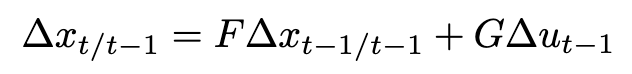

観測方程式 (線形)

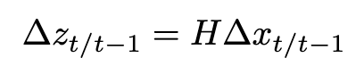

非線形関数 $f(x)$ をヤコビアン $F$，$G$ に分解し，非線形関数 $h(x)$ は ヤコビアン $H$ に変換します．(状態 $x$ は $n$ 次元，入力 $u$ は $m$ 次元，観測 $z$ は $k$ 次元とします)

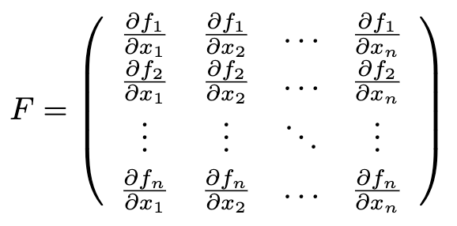

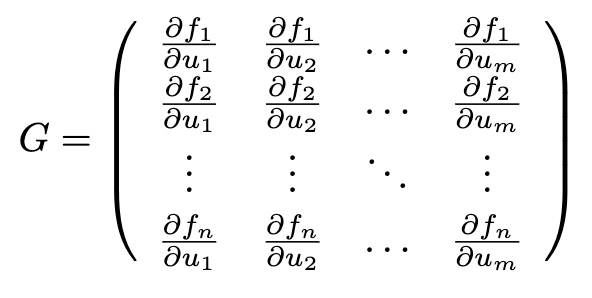

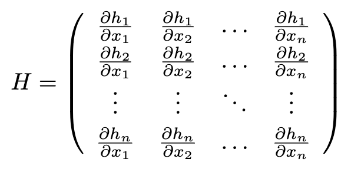

以上，ヤコビアンが手に入りました．これを使えば線形カルマンフィルタとほとんど同様の手順で状態を推定することができます．拡張カルマンフィルタでの更新手順をまとめると下記のようになります．

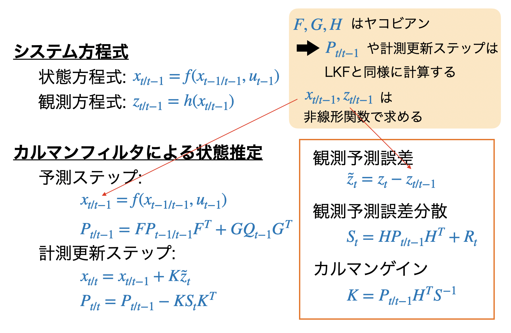

線形カルマンフィルタによる状態推定は [こちら](https://github.com/hsmtknj/robotics/tree/master/Linear_Kalman_Filter) を参照ください．

# 拡張カルマンフィルタの実装例

[main.ipynb](https://github.com/hsmtknj/robotics/blob/master/Extendet_Kalman_Filter/main.ipynb) を参照ください．