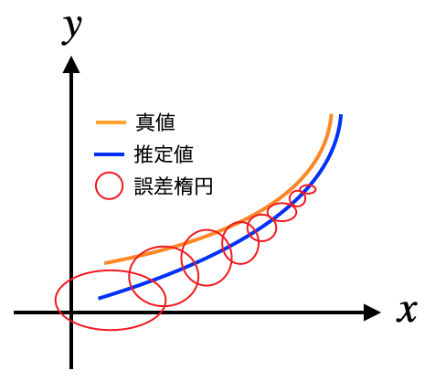
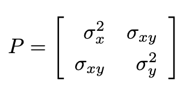
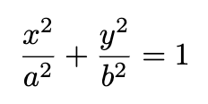
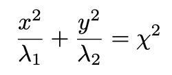
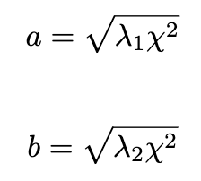
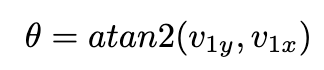

# 誤差楕円を可視化する

## Note
この README.md だと文中の数式が見にくいので，同階層の「 [README.pdf]()」を参照された方が見やすいかもしれません．

# はしめに

カルマンフィルタなどを実装していると，分散が本当に小さくなっているのか，またどのように小さくなっていくのか確認したくなるときがあります．

そのような場合に，下記図のように誤差楕円 (Error Ellipse) を可視化することで，直感的に分散が小さくなっていく過程を確認することができます．

例えば，位置 $(x, y)$ とその分散を可視化する場合は，$x, y$ それぞれの分散と共分散から，誤差を表す楕円のパラメータを計算することで誤差楕円を描画することができます．

# 誤差楕円

誤差楕円は次の2ステップで求めることができます．

1. 楕円の形を求める
2. 楕円の傾きを求める

この楕円の形や傾きは，次の分散共分散行列から求めることができます．(簡単のため2x2の行列で考えることとします)

それでは上記に2ステップについて説明を行っていきます．

# 楕円の形を求める

楕円の一般識は次のとおり定義されます．

つまり，パラメータ $a, b$ を求めることができれば楕円の形を求めることができます．

さっそくですが，誤差楕円の形は次で求めることができます．

ここで，$\lambda_1, \lambda_2$ は分散共分散行列 $P$ の固有値（$\lambda_1 > \lambda_2$ とします）で，$\chi^2$ はカイ二乗値を表します．

ですので，$\lambda$ については $P$ を固有値分解すれば取得できます．

$\chi^2$ については，可視化したい範囲を自由度に応じたカイ二乗分布表から決定します．

例えば自由度2 (x, y) で有意確率99%であれば，0.02010 となります．この場合は，誤差楕円内にいる確率が99%であることを示します．

よって，$a, b$ は次のように求めることができます．

以上で楕円の形を特定できました．

# 楕円の傾きを求める

続いては，楕円の傾きを求めます．

傾きは，分散共分散行列 $P$ の固有ベクトルから求めることができます．固有値 $\lambda_1, \lambda_2$ に対する固有ベクトルを $v_1, v_2$ とすると，固有値の大きい方に該当する固有ベクトルを用いて，次のように角度を求めることができます．

$P$ の $\sigma_{xy}$ の要素が強く影響するので，例えばここを $0$ とすると $\theta$ は $0$ となります．

# 誤差楕円の実装例

[main.ipynb]() を参照ください．