# 線形カルマンフィルタ : Linear Kalman Filter (LKF)

## Note
この README.md だと文中の数式が見にくいので，同階層の [README.pdf](https://github.com/hsmtknj/robotics/blob/master/articles/Linear_Kalman_Filter/README.pdf) を参照された方が見やすいかもしれません．

# はじめに

カルマンフィルタは[ ルドルフ・カルマン ( Rudolf Emil Kalma ) ](https://ja.wikipedia.org/wiki/%E3%83%AB%E3%83%89%E3%83%AB%E3%83%95%E3%83%BB%E3%82%AB%E3%83%AB%E3%83%9E%E3%83%B3)によって提唱されたフィルタで，**時々刻々と変化する量 (物体の位置とか速度とか)** を推定するときに用いられます．

アポロ計画にも採用された経緯があり，現在でも幅広く利用されている技術です．このカルマンフィルタをベースとして拡張カルマンフィルタ (EKF: Extended Kalman Filter) や，Unscented カルマンフィルタ (UKF: Unscented Kalman Filter) へと発展していきますので，それらを理解するにあたって，ベースとなるカルマンフィルタを理解しておくことは重要です．

※ ちなみにカルマンフィルタといえば，一般的に線形カルマンフィルタのことを指すので，以下では，線形カルマンフィルタのことをカルマンフィルタと呼びます．

# カルマンフィルタとは何か

カルマンフィルタは，**誤差のある観測値を用いて，ある動的システムの状態を推定したり制御**したりするときに用いられます．

上の文章だけでは少し分かりにくいので，「動く自動車の距離を測定する」という具体的なシーンでカルマンフィルタを考えてみたいと思います．

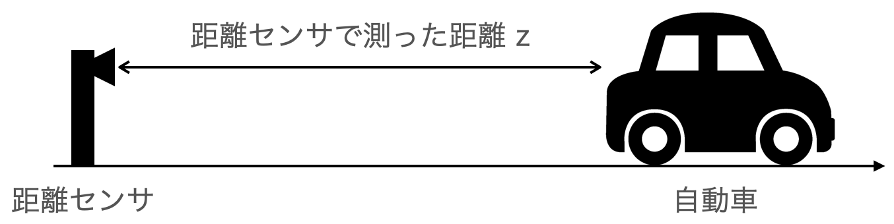

Fig.1 距離センサで自動車の位置を推定する例

ここで距離センサから自動車までの距離を知りたいとき，距離センサで完璧な値 $z$ を測定できれば何も問題はありません．距離センサの値をそのまま使えば良いのです．

しかし，現実にはそんな完璧なセンサはなく，残念ながら必ず**ズレ**が出てしまいます．

カルマンフィルタは，この **ズレ** を統計的にモデル化することで，完璧に知ることが難しい距離や速度などの真の状態 (隠れ状態といいます) を推定することができます．

# 逐次的に状態を推定するカルマンフィルタ

カルマンフィルタでは，時々刻々と変化する状態を推定するために2つの重要な方程式を立てる必要あります．

# 1. 状態方程式

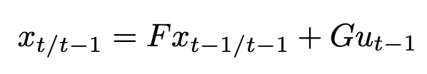

カルマンフィルタを使っていると必ず出てくる線形式です．現代制御理論を学ばれている方であれば馴染み深い式かもしれませんが，慣れてないと「これはどっから出てきた何の式？」と混乱してしまうかもしれませんね．(後で具体的な例を出します)

まず，$x$ が推定したい状態です．（例えば位置とか）

状態 $x_{t-t/t-1}$ に対して，何かしらの入力 $u_{t-1}$ を受けることで，状態は $x_{t/t-1}$ へと遷移するだろうと、この式は言っています．(こういう現在状態が1時刻前の状態のみから決定されることをマルコフ過程と言います)

ここで，この状態方程式は，$t-1$ の状態である $x_{t-1/t-1}$ から $t$ の状態ではこのようになっているんじゃないか？という $t$ の状態 $x_{t/t-1}$ を **予測する** ものであることに注意します．

仮にこの状態方程式の予測が完璧であるとするのであれば，この遷移式をそのまま適用して次状態を推定すれば良いわけです．しかし，実際はそう簡単にはいかず，予測はずれてしまうものです．カルマンフィルタでは，このずれた予測値とずれた観測値をうまい具合に合わせて，真の状態を推定するものですので，真の状態を推定するにはセンサ値などの観測値が必要となります．

ちなみに状態方程式は，物理式などから自分で式変更などして導くものです．

例えば Fig.1 の自動車の例で言えば，$x_{t}=x_{t-1}+v_{t-1}\tau$ ($\tau$ は時間) のように当たり前な式から状態方程式は導出されます．

物理的な拘束式をたて，上記の状態方程式のように変換すれば，$F$ や $G$ といった行列も自動的に求まります．(上の例でいくと，$F$は1で，$G$は$\tau$ですね)

つまり状態方程式において，$F$や$G$といった行列は，このシステムの特性そのものを表すものだと言えます．

# 誤差はガウス分布に従う

上で説明した，状態 $x_{t}$ や入力 $u_{t}$ は，当然ズレるものだとして，カルマンフィルタでは扱いますが，このときの誤差は **ガウス分布に従う** と仮定します．(これ重要です)

なので，状態 $x_t$ や入力 $u_t$ は分散 (分散共分散行列) を持つことになります．

分散が小さければ小さいほど得られた値は有効だと言えると思いますので，カルマンフィルタではこの分散を最小にするように状態を更新していきます．(ここはかなりキモです．この考えから最適カルマンゲインなどを導出することができます)

ただし，状態方程式や後に出る観測方程式が線形であるという縛りがあったり，誤差がガウス分布に従うといった制約があるので，これらが成り立たない場合は，カルマンフィルタの適用が難しいかもしれません．(例えば，AかBのどっちかの位置にいると思うが，その間にいることはない，といったことは表現できません．)

また，各確率変数同士は**互いに独立**だという制約もあります．よって，$x$ と $u$ は独立なので，共分散は 0 になります．(これも重要です)

逆に言うと $x$ と $u$ に相関があるようなケースでは，うまく表現ができないかもしれません．

# 2. 観測方程式

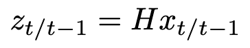

こちらが2つめに重要な方程式の観測方程式です．
これは先ほど状態方程式から予測で求めた $x_{t/t-1}$ から，たぶんセンサの観測ではこんな値を得られるんじゃね？と観測値を予想したものです．

ここで $z_{t/t-1}$ が予想観測値で，この値と実際の観測値 $z_{t}$ を用いて，時刻 $t$ の真の状態 $x_{t}$ を推定することになります．

ちなみに，この方程式も自分で導きます．

Fig.1 の例だと， $z_{t/t-1} = x_{t/t-1}$ ですね．推定したい状態と観測されるものが同じものなのでこうなります．この場合，状態方程式の $H$ は 1 になります．

この $H$ は隠れ状態をセンサで観測されるときの予測値に変換する役割があり，やはり物理式などから式変形により自動的に決まってくるものになります．(状態方程式もそうですが，解きたい問題にあわせてこの観測方程式も立式する必要があります．面白くもあり，難しくもあるところですね．)

# カルマンフィルタによる状態推定の概要

推定対象の時刻 $t$ の状態を $x_{t}$ とすると，先ほど説明した状態方程式や観測方程式を用いて，下の図のようなフローで $x_{t}$ は時系列的に推定されます．

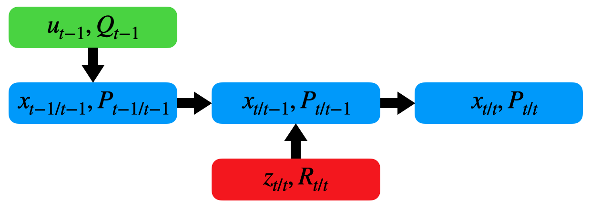

Fig.2 カルマンフィルタの推定フロー

時刻 $t-1$ から時刻 $t$ の推定過程をかなりざっくり説明すると...

1. 予測
    - 時刻 $t-1$ の状態 $x_{t-1/t-1}$ は入力 $u_{t-1}$ を受けて，$x_{t/t-1}$ となることが予想される
        - $P$, $Q$ はそれぞれ 状態 $x$, 入力 $u$ の分散です

2. 計測更新
    - 予想された状態 $x_{t-1/t-1}$ は実際にセンサ等で観測された値 $z_{t}$ を用いて補正され，$x_{t/t}$ であると推定される
        - $R$ は観測の分散です

こんな流れです．かなりいろいろ説明をすっ飛ばしていますが，状態の更新フローのイメージを掴んでもらえればよいかと思います．

ちなみにシステム方程式とカルマンフィルタによる状態の更新のまとめは下記です．（これは $x$ や $u$，$z$ が多次元の場合のカルマンフィルタ適用式です）

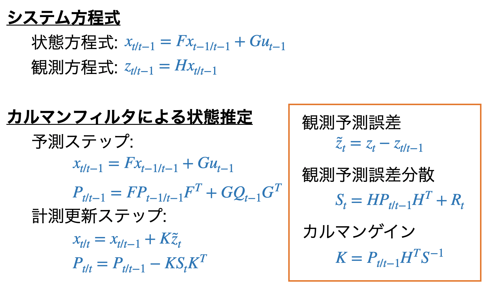

上記の更新ステップで具体的に何をやっているのかを次以降で説明していきます．

# カルマンフィルタ: 予測ステップ

ここでは，状態方程式の通り，時系列的に状態を予測していきます．

あくまで $x_{t/t-1}$ は 時刻 $t-1$ の状態 $x_{t-1/t-1}$ から「次の状態はたぶんこうなるんじゃね」というのを物理的拘束式から予測した値であることに注意してください．

また分散の定義から $P_{t/t-1}$ は次のように求められます．(簡単のため1次元で求めます)

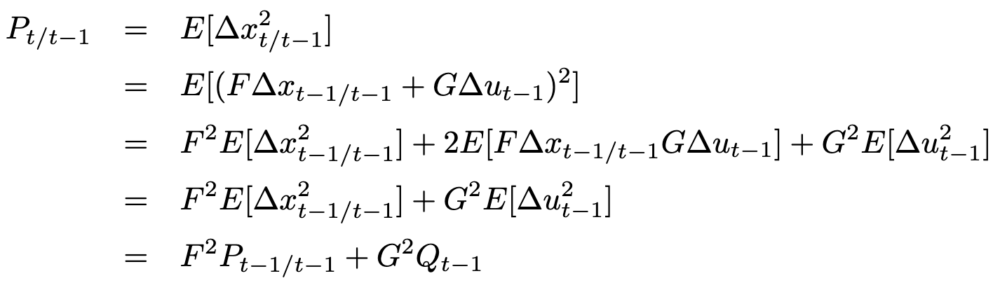

$E[ ]$は期待値を求める関数です．カルマンフィルタでは，$x$ と $u$ は互いに独立という仮定なので，共分散部分は0となります．また多次元の場合は $F^2 P$ や $G^2 Q$ は $F P F^T$，$G Q G^T$ となります．

# カルマンフィルタ: 計測更新ステップ

次は実際に観測したセンサ値と先ほどの予測値を用いて，真の状態を推定します．

まずは，先ほど予測した状態から予測観測値と，分散の定義式からその予測分散を求めます．

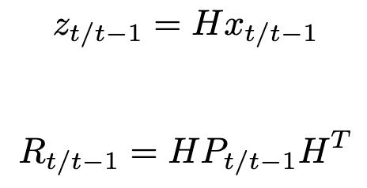

ここで問題なのは，実際のセンサで観測された $z_{t}$ と予測観測値である $z_{t/t-1}$ のどちらをどのように採用するか，ということです．

カルマンフィルタでは，これらの値を線形結合し，重みを分散が最小になるように決定します．

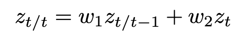

具体的には，上の式のような線形結合式を立てたときに，重み $w_{1}$，$w_{2}$ ( $w_{1}+w_{2}=1$ ) を $z_{t/t}$ の分散が最小になるように求めます．

ということで，$z_{t/t}$ の分散を定義式から求めます．（簡単のため1次元で求めます）

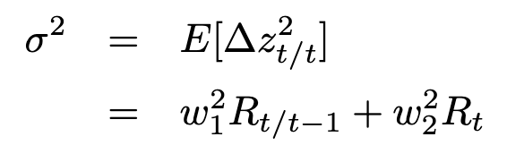

これを最小化するように，下記のように偏微分することで重み $w_{1}$，$w_{2}$ を求めます．$w_{1}$ が決まれば，$w_{1}+w_{2}=1$ より $w_{2}$ も決まりますね．

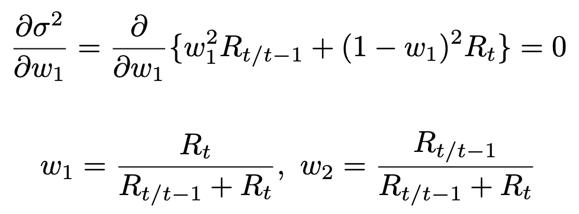

この重みを使って，状態を更新する式へと式変形していきます．

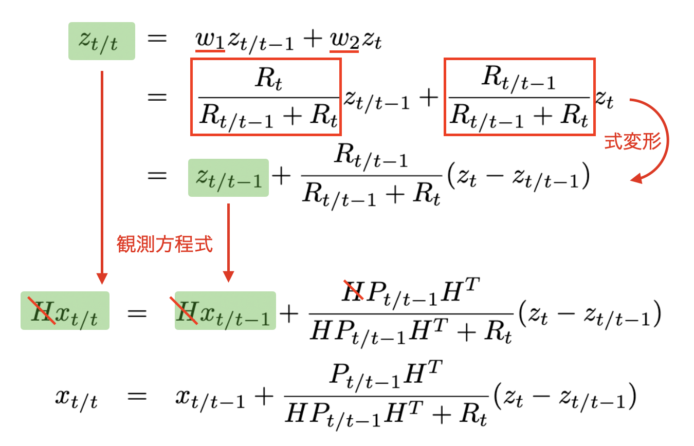

この式から，カルマンゲイン $K$ や観測予測誤差 $\tilde{z}$，観測予測誤差分散 $S$ を次のように導出することができます．

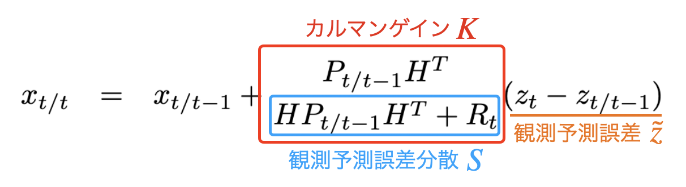

# カルマンフィルタの実装例

[main.ipynb](https://github.com/hsmtknj/robotics/blob/master/articles/Linear_Kalman_Filter/main.ipynb) を参照ください．